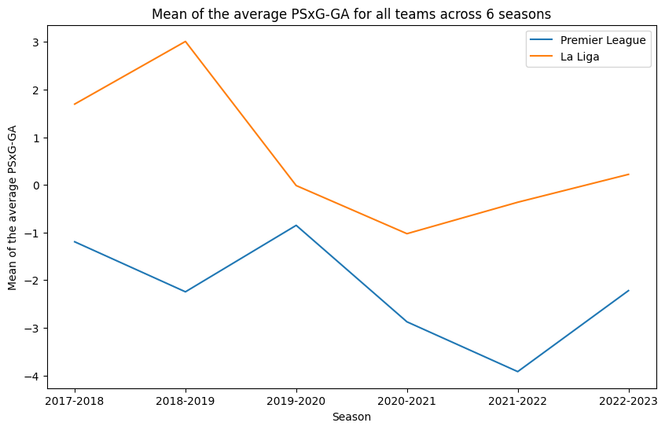
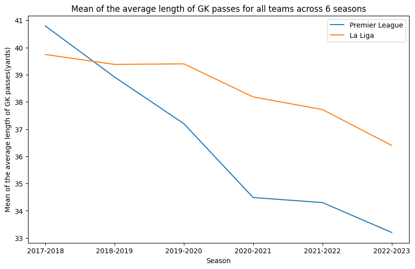

# A statistical analysis to summarise the evolution of the goalkeeper in football

The role of the goalkeeper in football has undergone a notable
evolution in recent years, extending beyond traditional shot-stopping
duties- Most notably, regarding their ability with the ball at their feet,
and how they distribute it. One can assume that the introduction of
the backpass rule in 1992, coupled with the success of pressing systems
deployed by some of the best clubs in world football, would demand
keepers who are committed to playing shorter accurate passes instead
of longer inaccurate clearances. After conducting a time series analysis
on data from the past six seasons across Europe’s top 2 leagues, the
Premier League and La Liga, the study concludes that while the shotstopping
metric has stayed relatively consistent, there has been a rise in
the importance of playing shorter passes, thereby indicating an increase
in the significance of ball distribution, confirming our assumption. The
Kendall’s tau statistical test is used to determine the significance of the
trends present in the metrics and comment on their increasing or decreasing
nature, when statistically significant.

Check [notebook](./eda.ipynb)

## Evolution of mean PSxG - GA:

## Evolution of the mean of the average length of the passes made by GKs:

